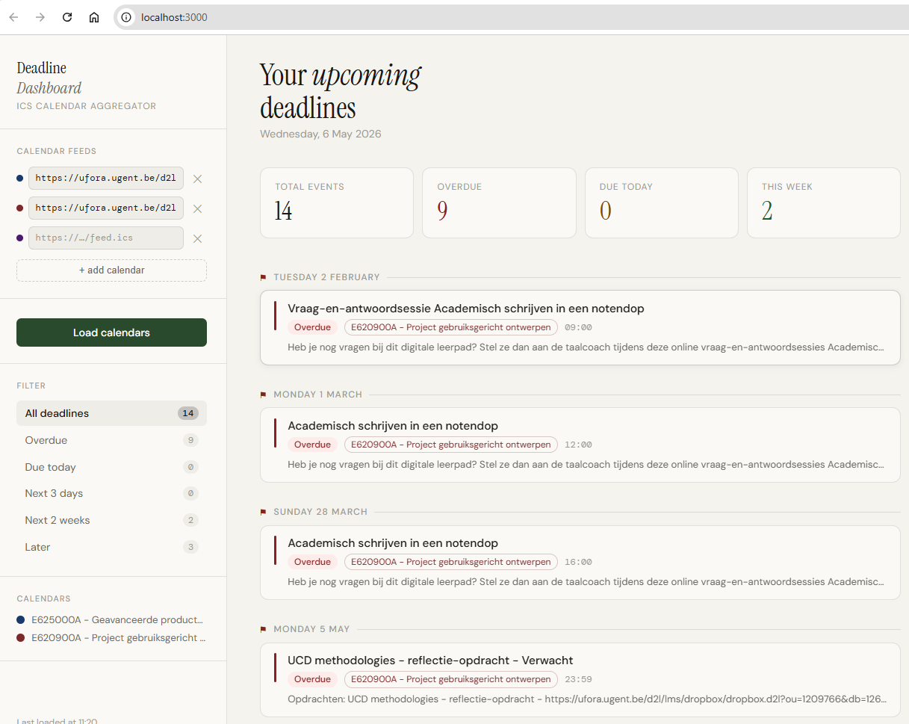

# IO Deadline Dashboard
Dashboard for deadlines of io courses based on Ufora ICS calendar feeds.

A local Node.js dashboard that fetches, parses, and combines ICS calendar feeds into a deadline overview.

🌐 Browser version: [Render Cloud Build](https://io-deadlines.onrender.com/)



## Setup

```bash
cd ics-dashboard
npm install
npm start
```

Then open **http://localhost:3000** in your browser.

## Usage

1. Add one or more `.ics` calendar feed URLs in the sidebar (Ufora, Google Calendar, Outlook, etc.)
2. Click **Load calendars**
3. Your URLs are saved to `calendars.json` so they persist between sessions

## Features

- Fetches ICS feeds server-side (no CORS issues)
- Combines multiple calendars into one unified timeline
- Urgency grouping: overdue / today / next 3 days / next 2 weeks / later
- Color-coded per calendar
- Shows event time, description, and location when available
- Persists your calendar URLs across restarts

## Requirements

- Node.js 16+
- npm

## Changing the port

```bash
PORT=8080 npm start
```