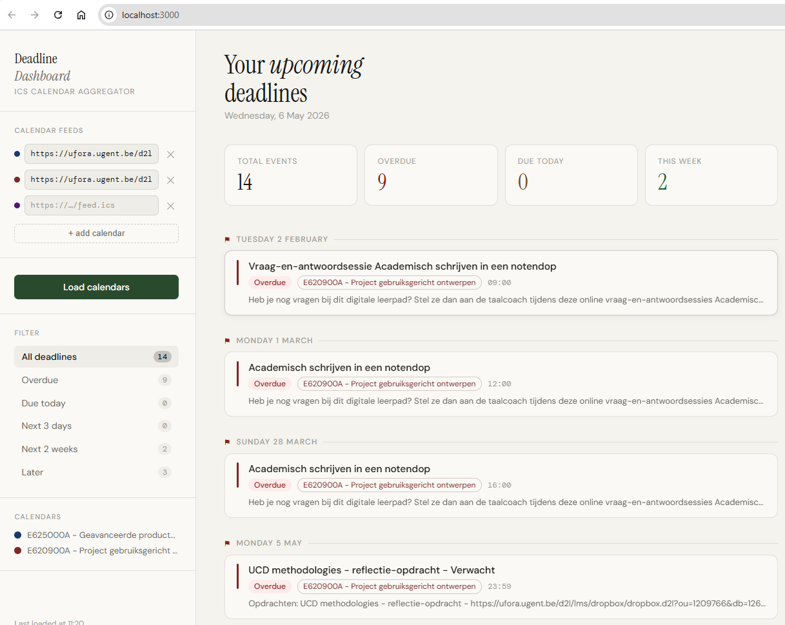

# IO Deadline Dashboard
Dashboard for deadlines of io courses based on Ufora ICS calendar feeds.

A local Node.js dashboard that fetches, parses, and combines ICS calendar feeds into a deadline overview.

🌐 Browser version: [Render Cloud Build](https://io-deadlines.onrender.com/)



## Setup

```bash
cd ics-dashboard
npm install
npm start
```

Then open **http://localhost:3000** in your browser.

## Usage

1. Add one or more `.ics` calendar feed URLs in the sidebar (Ufora, Google Calendar, Outlook, etc.)
2. Click **Load calendars**
3. Your URLs are saved to `calendars.json` so they persist between sessions

### Programme-year presets

Fixed calendar sets (1IO – 4IO) are defined in `presets.yaml` and appear as buttons in the sidebar.
Clicking one loads its feeds; editing the list switches back to **Custom**. You can link directly to a set with `?set=2IO`.

```yaml
1IO:
  - https://ufora.ugent.be/d2l/le/calendar/feed/user/feed.ics?feedOU=...&token=...
  - https://ufora.ugent.be/d2l/le/calendar/feed/user/feed.ics?feedOU=...&token=...
2IO:
  - https://...
```

## Features

- Fetches ICS feeds server-side (no CORS issues)
- Combines multiple calendars into one unified timeline
- Urgency grouping: overdue / today / next 3 days / next 2 weeks / later
- Color-coded per calendar
- Shows event time, description, and location when available
- Persists your calendar URLs across restarts

### Student effort estimates

Every deadline shows hour-range buttons (<1h, 1–3h, 3–8h, 8–20h, 20h+). Before the deadline students give the time they expect it to take, afterwards the time it actually took; both averages are shown on the item. Answers are anonymous (a random id per browser), and clicking your answer again removes it.

Answers are stored in Postgres when `DATABASE_URL` is set (e.g. a free Supabase or Neon database; the table is created automatically). Without it they go to a local `estimates.json`, which is fine for local testing but is wiped on every Render redeploy.

On Render: *Environment → Add environment variable* → `DATABASE_URL` = the connection string of your database.

#### Supabase setup

1. Create a project at [supabase.com](https://supabase.com) (region: *Central EU (Frankfurt)*), and note the database password.
2. Click **Connect** (top of the project) → **Session pooler** and copy the URI:
   `postgresql://postgres.<project-ref>:[YOUR-PASSWORD]@aws-0-eu-central-1.pooler.supabase.com:5432/postgres`
   Use the *session pooler*, not the *direct connection*: the direct one is IPv6-only and Render can't reach it.
3. Replace `[YOUR-PASSWORD]` with your password (URL-encode special characters, e.g. `@` → `%40`).
4. Put the URI in `DATABASE_URL` on Render and deploy. The logs should show `Effort estimates: Postgres connected`; the `effort_estimates` table then appears in Supabase's *Table Editor*.

Free Supabase projects pause after a week without activity; restore them from the dashboard.

## Requirements

- Node.js 16+
- npm

## Changing the port

```bash
PORT=8080 npm start
```